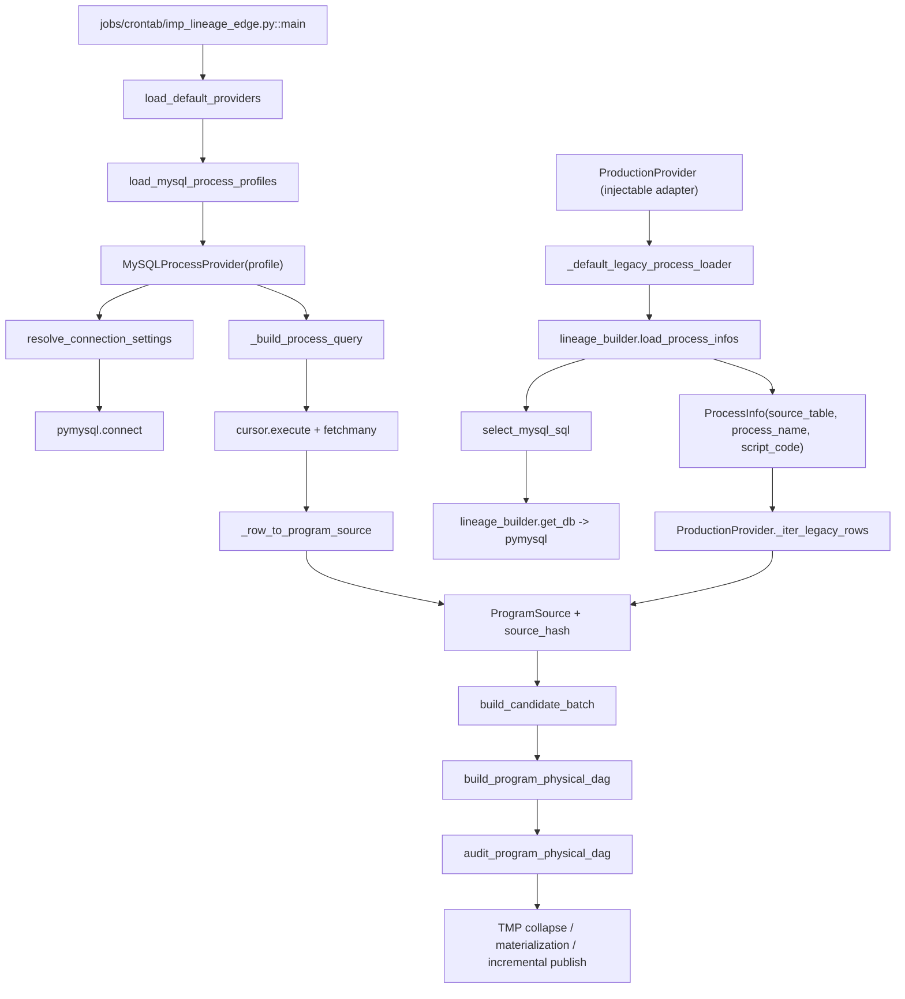
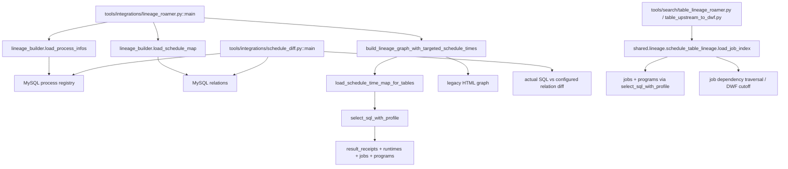
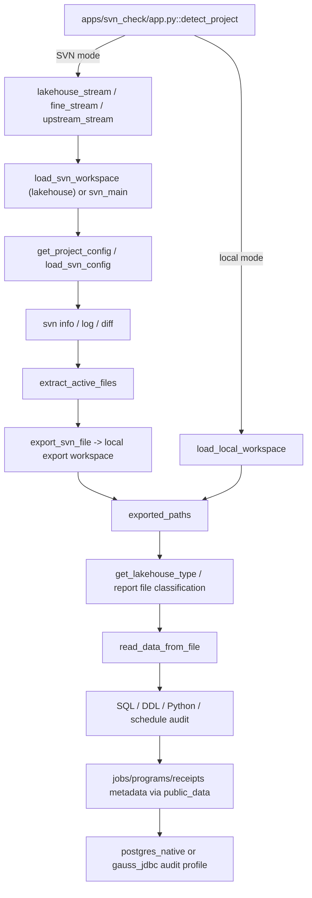

# Lineage Source Inventory

> 本文档对应独立 Issue **Legacy Source Inventory & Mapping**，不是新的 Phase。
> 盘点基线为当前 `main` 的公开源码、公开示例配置、demo schema、fixture 和
> 已有开发文档。本文只记录静态代码事实，不连接 MySQL、SVN、JDBC 或内网服务。

## 1. Scope

本轮扫描了以下范围，并沿入口、调用者和被调用者核对了读取路径：

- `shared/lineage/`
- `shared/config/`
- `apps/svn_check/`
- `jobs/`
- `tools/`
- `configs/`
- `tests/`
- `docs/`

重点入口包括：

- `shared.lineage.lineage_builder.load_process_infos()`
- `shared.lineage.providers.MySQLProcessProvider`
- `shared.lineage.providers.ProductionProvider`
- `jobs.crontab.imp_lineage_edge.main()`
- `apps.svn_check.services.svn_service.svn_main()`
- `apps.svn_check.services.workspace_service.load_svn_workspace()`
- `apps.svn_check.services.workspace_service.load_local_workspace()`
- `apps.svn_check.core.public_data` 的 jobs/programs/receipt 查询
- `shared.lineage.schedule_table_lineage` 的作业依赖读取
- `tools/integrations/` 中的 legacy MySQL 读取副本

### 1.1 阅读约定

本文使用以下边界，避免把公开 demo 名称误当作内网事实：

- **PUBLIC PLACEHOLDER**：`demo_meta.*`、`metadata_table(...)`、
  `*.example.invalid`、`DEMO_*`、`localhost` 和 `examples/` 等公开占位值。
  它们不能反推出真实 schema、表名、URL 或资产名。
- **HISTORICAL SEMANTIC**：源码实际使用的概念和列语义，例如
  `process_name`、`script_code`、`target_table`、`dependency_text`。
- **UNKNOWN — requires intranet verification**：公开仓库没有足够证据证明的
  内网事实，本文不做推断。
- **FULL** 只表示当前代码契约已经覆盖，不表示已用真实内网数据验证。
- 本文没有修改 Phase 1～7 主链，也没有新增 `SVNProgramSourceProvider`。

## 2. Executive Findings

### Q1：程序代码从哪里读取？

结论分为 formal lineage 和 legacy audit 两条路径：

| 路径 | 代码事实 | 角色 |
| --- | --- | --- |
| DEV formal lineage | `shared/lineage/providers.py::MySQLProcessProvider` 根据 profile 查询配置的 process table，读取 program-name 列和 script/code 列，并通过 `fetchmany()` 生成 `ProgramSource`。 | 当前 V1 的正式程序代码入口 |
| legacy/PROD adapter | `ProductionProvider` 默认调用 `_default_legacy_process_loader()`，再调用 `shared.lineage.lineage_builder.load_process_infos()`；后者通过 `pymysql.connect()` 查询 process registry 的 `script_code`。 | 现有 legacy loader 的适配入口；不是另一套已验证的生产连接 |
| SVN 审计 | `svn_service.svn_main()` 使用 SVN `diff` 找到变更文件，再 `svn export` 到本地导出目录；`lakehouse_stream`、`fine_stream`、`upstream_stream` 随后调用 `read_data_from_file()` 读取导出文件。 | 开发/审计代码来源，不进入当前 `ProgramSource` 主链 |
| local workspace 审计 | `load_local_workspace()` 扫描调用方传入的目录；审计 UI 直接读取这些本地文件。 | 本地审计来源，不进入当前 `ProgramSource` 主链 |
| `programs.file_path` | `apps/svn_check` 用它与 JOB 元数据合并、做路径尾部匹配和展示；代码内容仍由导出的/本地文件路径读取。 | 程序路径 metadata，不是当前 formal lineage 的代码读取器 |

因此，当前仓库能够证明的 formal lineage 代码来源是 **MySQL process metadata
或其 legacy loader**；SVN 和 local workspace 是另一个审计工作流。

### Q2：四套 DEV MySQL 是否相同 schema？

结论：

```text
UNKNOWN — requires intranet verification
```

公开证据只有：

1. `configs/lineage_providers.example.yaml` 展示了 `mysql_dev_a` 和
   `mysql_dev_b`，两者使用同一个公开占位 `demo_meta.processes`、
   `process_name`、`script_code` 配置。
2. `tests/shared/test_lineage_providers.py` 为测试创建了 A/B/C/D 四个 profile，
   并验证四个 profile 可以分别建立连接和输出不同 `source_profile`。
3. `MySQLProcessProfile` 明确允许每个 profile 单独配置
   `process_table`、`program_name_column`、`script_code_column` 和
   `expected_target_column`。

这些证据证明的是 **profile abstraction 支持每个来源独立的表/列映射**，不证明
真实 DEV A/B/C/D 的 schema、字段、过滤规则或编码相同。

工程假设仅限于：

```text
profile supports per-source table/column mapping
```

真实 A/B/C/D 的 table、column、filter、encoding、row count 和 target authority
必须在内网核验。

### Q3：SVN 的真实角色是什么？

```text
SVN Lineage Role: B — development/audit source
```

证据：

- `apps/svn_check/services/svn_service.py::svn_main()` 返回的是
  `exported_paths`、变更文件、trunk 重叠文件和 revision 信息，没有返回
  `ProgramSource`。
- `apps/svn_check/ui/lakehouse_stream.py` 将这些路径交给
  `get_lakehouse_type()`、规则函数和 `read_data_from_file()`。
- `apps/svn_check/ui/fine_stream.py`、`upstream_stream.py` 也直接调用
  `svn_main()`，然后对导出的报表/脚本进行检查。
- `jobs/crontab/imp_lineage_edge.py::load_default_providers()` 只加载
  `MySQLProcessProvider`；当前默认 formal lineage 编排没有 SVN 调用。
- 仓库内没有 `SVNProgramSourceProvider`，也没有证据表明
  `SVN file -> ProgramSource -> physical DAG` 是现行链路。

当前可还原的关系是：

```text
SVN -> branch diff / trunk overlap -> export -> local workspace -> audit
MySQL process metadata -> ProgramSource -> Physical DAG -> Audit -> materialization
```

不能因为仓库存在 SVN 代码，就自动把 SVN 设计成 `ProgramSource` provider。

### Q4：Phase 2 已覆盖什么？

- `MySQLProcessProvider` 已覆盖：profile 级连接配置、process registry 查询、
  program name/script code 映射、可选显式 target 列、lazy connection、
  `fetchmany()` streaming、bytes/bytearray 基础解码和 `source_hash`。
- `ProductionProvider` 已覆盖：把既有 `ProcessInfo`、mapping row 或对象 row
  转换为 `ProgramSource`，兼容 `process_name`/`program_name`、
  `script_code`/`code`，并支持显式 target getter。
- `ProductionProvider` 当前没有接入 `load_default_providers()` 的默认 main；它
  是可注入的 adapter。默认 `imp_lineage_edge.main()` 当前仍只从 configured
  MySQL profiles 建立 providers。
- relations、jobs、programs、result receipts、runtimes、SEND/RECV 和字段
  mapping 仍属于各自的 legacy metadata/audit contract，不会自动变成
  `ProgramSource` 字段。

### Q5：真正的生产化 gap

已知 gap 不是重写血缘算法，而是：

1. 核验 DEV A/B/C/D 的真实连接和 source mapping；
2. 核验 target 的权威来源，是 process row 的显式列、program metadata、还是
   其他 join，不能沿用旧 process name 猜测；
3. 核验实际 code 返回类型和编码，特别是 CLOB/driver-specific object；
4. 核验 PROD loader 的真实 backend、行 shape 和是否需要额外 job identity；
5. 核验 public demo 中多个 receipt/mapping SQL 变体对应的内网 canonical contract；
6. 保留 SVN 审计工作流，除非后续证据证明 SVN 文件才是 authoritative lineage
   program source。

目前没有证据要求修改 `ProgramSource`、Physical DAG、Audit、Materialization、
Query 或 Phase 7 的 history/diff 语义。

## 3. Historical MySQL Sources

### 3.1 Connection Logic

| Code path | Connection implementation | Environment/config facts | Query behavior | Current consumer |
| --- | --- | --- | --- | --- |
| `shared/lineage/lineage_builder.py::get_db()` | `pymysql.connect(**DB_CONFIG)` | `PYTOOLS_LINEAGE_MYSQL_HOST`、`PYTOOLS_LINEAGE_MYSQL_USER`、`PYTOOLS_LINEAGE_MYSQL_PASSWORD`、`PYTOOLS_LINEAGE_MYSQL_DATABASE`；公开默认值为 `localhost`/`pytools_demo` 占位；user/password 在连接时 required。 | `select_mysql_sql()` 会 `ping(reconnect=True)`，`cursor.execute()` 后 `fetchall()`，最后关闭 cursor/connection。 | `load_process_infos()`、`load_schedule_map()`；也被 `ProductionProvider` 和 `lineage_roamer` 间接使用。 |
| `tools/integrations/sql_upstream_to_layer.py` | 独立 `pymysql.connect()` | `PYTOOLS_MYSQL_HOST/USER/PASSWORD/DATABASE`，charset `utf8mb4`，autocommit；没有显式配置 port。 | 同样读取 process registry 和 relations；另用 `shared.db.gaussdb` 查 DWF endtime。 | 手动 SQL/schedule 到 DWF 追踪；deprecated compatibility tool。 |
| `tools/integrations/schedule_diff.py` | 独立 `pymysql.connect()` | `PYTOOLS_MYSQL_HOST/USER/PASSWORD/DATABASE`。 | 读取 processes，按 target 参数查询 relations，比较 SQL 实际引用和配置关系。 | 手动调度差异检查。 |
| `tools/integrations/mysql_dependency_search.py` | 独立 `pymysql.connect()` | `PYTOOLS_MYSQL_HOST/USER/PASSWORD/DATABASE`。 | 只读取 `process_name, script_code`，在内存中做字符串关键字搜索。 | 手动脚本依赖搜索。 |
| `tools/jobgraph/job_dependency_cycle_check.py` | 独立 `pymysql.connect()` | `PYTOOLS_MYSQL_HOST/USER/PASSWORD/DATABASE`。 | 读取 logical `relations` key 对应的 `job_name, dependency_name`；代码默认公开表为 `job_dependencies`。 | 手动作业依赖成环检查。 |
| `tools/integrations/cms_comments.py` | 定义了独立 `pymysql.connect()` | `CMS_MYSQL_HOST/USER/PASSWORD/DATABASE`。 | 当前 `main()` 走 CMS HTTP/OAuth 的 `columnConfigs`，仓库内没有调用其 `select_mysql_sql()` 读取器。 | 可选 CMS mapping SQL 生成；不是当前 lineage reader。 |
| `shared/lineage/providers.py::MySQLProcessProvider` | `default_mysql_connection_factory()` 调 `pymysql.connect()` | 每个 profile 保存 env variable names；显式 host/port/user/password/database/charset/autocommit。连接值不写入 profile。 | profile 的 table/column 经过 `safe_identifier()`；只拼接已校验标识符，过滤 `script_code IS NOT NULL`。使用 `fetchmany(batch_size)`。 | 当前 V1 DEV provider。 |

以上代码中的真实内网 host、port、database、schema、账号和密码均未被本轮读取
或新增；公开默认值不是内网证据。

### 3.2 Process Registry

`shared/lineage/lineage_builder.py` 的历史 SQL 是：

```sql
SELECT 'process_registry' AS source_table, process_name, script_code
FROM <metadata_table("processes", "processes")>
WHERE script_code IS NOT NULL
```

其中 `<metadata_table(...)>` 是 **PUBLIC PLACEHOLDER**；公开环境可能展开为
`demo_meta.processes`，不能据此反推内网真实表名。

| Historical concept | Columns used | Filter / key behavior | Meaning | Historical consumers | Current V1 mapping |
| --- | --- | --- | --- | --- | --- |
| program/process registry | `process_name`、`script_code`；SQL 还返回固定字面量 `source_table='process_registry'` | 只保留 `script_code IS NOT NULL`；旧 `ProcessInfo` 使用 `source_table, process_name, script_code`。 | `process_name` 是旧程序/任务标识；`script_code` 是待解析代码。 | `load_process_infos()`、`lineage_roamer`、`sql_upstream_to_layer`、`schedule_diff`、`mysql_dependency_search`。 | `ProgramSource.program_name`、`ProgramSource.script_code`、`environment/source_profile`。 |
| process source marker | DDL demo 另有 `source_name`，但 `PROCESS_SQL` 没有读取它 | 不能把 `source_name` 与 SQL 返回的固定 `source_table` 混为一谈。 | 公开 DDL 的来源标记和历史查询返回的 synthetic marker 是两个事实。 | 旧 loader only。 | 当前 `MySQLProcessProvider` 用 `source_profile` 表达来源逻辑身份。 |

旧 builder 的 target 处理是另外一层：

- `process_target_name()` 按 `process_name` 的 `:` 后半段推导表名；
- `process_task_name()` 从同一命名格式推导任务名；
- `build_target_map()` 使用这个推导结果构建旧 graph。

这是 legacy graph 的命名推导，不是 `ProgramSource.expected_target` 的可靠显式
来源。V1 adapter 在没有明确 target 列/getter 时保持 `expected_target=None`，不
把程序名或 SQL 最后一个表猜成 target。

### 3.3 Duplicated Historical Readers

以下文件复制了 process/relations 读取逻辑，而不是共享一个 MySQL reader：

| File | Process query | Additional behavior | Decision |
| --- | --- | --- | --- |
| `tools/integrations/sql_upstream_to_layer.py` | `process_name, script_code` + synthetic `source_table` | SQL 实际上游或 relations 调度追踪，截止 DWF；endtime 另查 receipt/runtime。 | `LEGACY_KEEP`；当前没有无损 formal replacement。 |
| `tools/integrations/schedule_diff.py` | 同一 process query | 按 target 查询 relations，对比实际 SQL 和配置关系。 | `LEGACY_KEEP`。 |
| `tools/integrations/mysql_dependency_search.py` | `process_name, script_code` | 只做字符串包含搜索，不构图。 | `LEGACY_KEEP`。 |
| `shared/lineage/lineage_builder.py` | 同一 process query | 旧 graph、normalization、schedule enrichment；仍是 Physical DAG 的 normalizer 依赖。 | `KEEP / compatibility`。 |

这些副本说明仓库有明确的历史 MySQL 语义，但不能证明内网存在同名表或同一
backend topology。

## 4. Historical Metadata Semantics

### 4.1 Table / Column / Join Inventory

公开 demo schema 的建表脚本是 `docs/dev/local_pg_audit_meta.sql`。其中所有
`demo_meta.*` 都是 **PUBLIC PLACEHOLDER**；下面记录的是源码已经使用的
**HISTORICAL SEMANTIC**，不是内网 schema 声明。

| Concept | Public logical artifact | Historical SQL / key columns | Join keys | Purpose | Used by lineage? | Used by schedule/audit? | Still needed? |
| --- | --- | --- | --- | --- | --- | --- | --- |
| process registry | `metadata_table("processes", "processes")` | `process_name`、`script_code`；旧查询过滤 `script_code IS NOT NULL`。demo DDL 还有 `source_name`，但旧查询未选。 | 无强制 join；旧 target 可从 `process_name` 命名推导。 | 提供程序标识和脚本内容。 | **是**：legacy loader、MySQLProcessProvider、ProductionProvider。 | 否/间接。 | **是**：formal ProgramSource 的主要历史输入。 |
| configured table relations | `metadata_table("relations", "relations")` | `target_table`、`source_table`；旧 SQL 过滤两者非空。 | 表名 pair。 | 保存配置/登记的表关系；不是 process code。 | **仅 legacy**：`load_schedule_map()`、`schedule_diff`、旧 DWF trace。 | **是**：关系差异和旧 schedule trace。 | **是**：legacy tools；不自动进入 V1 ProgramSource。 |
| jobs | `metadata_table("jobs", "jobs")` | `plan_name`、`sequence_name`、`job_name`、`program_name`、`status`、`event_text`、`dependency_text`、`realtime_flag` 及 option 列。 | `jobs.program_name = programs.program_name`；`dependency_text` 内含 `33:<job>` 关系。 | 作业、作业流、依赖、状态、参数和执行域。 | **不是 V1 ProgramSource 直接输入**。 | **是**：审查 UI、`schedule_table_lineage`、SEND/RECV 重建。 | **是**：schedule/audit legacy contract。 |
| programs | `metadata_table("programs", "programs")` | `program_name`、`program_key`、`language`、`file_path`、`target_table`、status/option 列。 | `program_name` 连接 jobs。 | 程序 catalog、代码路径和显式目标表。 | **当前 V1 不直接读取**；target 可由 profile/getter 注入。 | **是**：JOB/PROGRAM 合并、结果表登记、审查展示。 | **是**：若内网 target authority 在此，需要 thin adapter/核验。 |
| result receipts | `metadata_table("result_receipts", "result_receipts")` | 读路径使用 `table_name`、`receive_plan`、`source_system`、`receive_job_name`、`source_job_name`。 | `source_job_name = runtimes.job_name`；表名与 receive plan 是登记关系。 | 结果表、接入计划、来源系统和接入/来源作业。 | **仅 legacy schedule enrichment**：`SCHEDULE_TIME_SQL` 用 table/source job。 | **是**：审查展示、DWF endtime、RECV 重建。 | **是**：但不应塞入 ProgramSource。 |
| runtimes | `metadata_table("runtimes", "runtimes")` | `job_name`、`end_time`。 | 与 receipt 的 `source_job_name` 或 jobs 的 `job_name` 连接。 | 提供最近/最大运行结束时间。 | 否。 | **是**：legacy schedule time / DWF report。 | **是**：旧调度展示；formal V1 不需要。 |
| receive plan catalog | `metadata_table("receive_plans", "receive_plans")` | `plan_name`、`source_system`。 | `plan_name` 与 receipt 的 receive-plan 语义对应。 | 接入计划到来源系统的 catalog。 | 否。 | **是**：`imp_recv_dwf`、PLAN 规则。 | **是**：RECV/audit。 |
| plan catalog | `metadata_table("plans", "plans")` | `plan_name`、`dependency_text`、`description`、`owner`、`status`、`calendar`。 | 与 jobs 的 `plan_name` 关联。 | 调度计划登记和规则校验。 | 否。 | **是**：`core.public_data.all_plan()` 和 PLAN 规则。 | **是**：schedule/audit。 |
| job outputs | `metadata_table("job_outputs", "job_outputs")` | `job_name`、`output_path`。 | `job_name` 与 jobs 关联。 | 作业输出路径索引。 | 否。 | **是**：审查 outfile、接口说明、orchestrator import。 | **是**：legacy output contract。 |
| SEND metadata | `metadata_table("send_jobs", "send_jobs")` | `send_name`、`job_name`、`target_table`、`field_list`。 | `job_name` 可与 jobs 关联。 | SEND 卸数目标和字段列表。 | 否。 | **是**：SEND search、`imp_send_lineage`。 | **是**：字段/发送工作流；不是 ProgramSource。 |
| field mapping | `metadata_table("relations", "asset_mappings")` 或运行态 mapping SQLite | `source_table`、`target_table`、`source_column`、`target_column`、`description`。 | source/target table + column。 | 字段级映射和注释导入。 | 否：formal V1 edge 是表级事实。 | **是**：`mapping_sqlite`、workspace field search、`imp_dws_comments`。 | **是**：不能用 V1 表级 edge 替换。 |
| schema/config catalog | `metadata_table("schema_config", "schema_config")` | `source_file`、`config_key`、`config_value`。 | 文件和配置 key。 | 本地 JSON schema/config 审核。 | 否。 | **是**：schema config import/review。 | **是**：审计；不是 ProgramSource。 |
| reference/parameter tables | `metadata_table("reference_tables", "reference_tables")` | `table_name`、`description`。 | 无。 | 码值/参数表登记，供代码审查分类。 | 否。 | **是**：`all_para_table_lists()`、workspace search。 | **是**：audit。 |
| catalog views/functions | information schema / `pg_proc` | 视图名、函数名。 | 与脚本中的 SQL object 名称匹配。 | 审查代码使用的 view/function catalog。 | 否。 | **是**：`audit_metadata_service`、`rule_dws_py()`。 | **是**：audit。 |

### 4.1.1 SQL Evidence Catalog

下表把关键 metadata concept 与源码中的 SQL 入口逐项对齐。SQL 中的
`__TABLE__`/`__*_TABLE__` 都是经过 `metadata_table(...)` 渲染的公开占位符。

| Concept | Historical SQL evidence | Key columns | Join keys | Purpose / consumer |
| --- | --- | --- | --- | --- |
| process registry | `SELECT 'process_registry' AS source_table, process_name, script_code FROM __PROCESS_TABLE__ WHERE script_code IS NOT NULL` | `process_name`, `script_code` | 无；旧 builder 另按 process name 推导 target | MySQL code reader、legacy graph、V1 provider。 |
| relations | `select target_table, source_table from __RELATIONS_TABLE__ where target_table is not null and source_table is not null`；`schedule_diff` 还按 `upper(target_table)` 参数过滤 | `target_table`, `source_table` | table pair | legacy configured relation、SQL/schedule diff、旧 DWF trace。 |
| jobs | `select plan_name, job_name, dependency_text from __JOBS_TABLE__`；`core.public_data.all_job()` 额外读取 program/status/event/options | `plan_name`, `sequence_name`, `job_name`, `program_name`, `dependency_text`, `event_text`, `status` | `jobs.program_name = programs.program_name`；`dependency_text` 解析 `33:<job>` | 作业依赖、审计展示、SEND/RECV 重建、schedule lineage。 |
| programs | `SELECT DISTINCT p.target_table AS table_name, j.job_name FROM __JOBS_TABLE__ j INNER JOIN __PROGRAMS_TABLE__ p ON j.program_name = p.program_name WHERE p.target_table IS NOT NULL`；`all_program()` 读取 `file_path`/`target_table` | `program_name`, `program_key`, `file_path`, `target_table`, `language`, `status` | `program_name` | 程序 catalog、显式 target、路径匹配；不是 V1 默认 code reader。 |
| result receipts | `select table_name, receive_plan, source_system from __RESULT_RECEIPTS__`；legacy schedule SQL 使用 `r.table_name`、`r.source_job_name` | `table_name`, `receive_plan`, `source_system`, `receive_job_name`, `source_job_name` | `source_job_name = runtimes.job_name` | RECV/result registration、来源系统、DWF endtime/audit。 |
| runtimes | `max(t.end_time)` in `SCHEDULE_TIME_SQL`, joined by job name | `job_name`, `end_time` | `job_name` | 运行结束时间 enrichment；不进入 ProgramSource。 |
| schedule | `build_job_sql()` reads `plan_name, job_name, dependency_text`; `build_table_job_sql()` joins jobs/programs by program name | `plan_name`, `job_name`, `dependency_text`, `target_table` | job dependency and `program_name` | `schedule_table_lineage` job traversal and DWF cutoff。 |

### 4.2 Target 语义不能合并为一个字段

仓库同时出现以下 target/table 语义，不能不加证据地互换：

| Source of target-like value | Code evidence | Semantics / boundary |
| --- | --- | --- |
| process name suffix | `lineage_builder.process_target_name()`、`sql_upstream_to_layer.process_target_name()` | legacy 命名推导；不是 V1 显式 target。 |
| process/profile target column | `MySQLProcessProfile.expected_target_column`、`MySQLProcessProvider._row_to_program_source()` | 只有 profile 明确配置列名时才映射到 `ProgramSource.expected_target`。 |
| production legacy target field/getter | `ProductionProvider._legacy_value()`、`expected_target_getter` | 允许 explicit `expected_target` 或注入 getter；没有则保留 `None`。 |
| programs metadata | `programs.target_table`，由 jobs/programs join 取得 | 程序 catalog 的显式目标；当前不自动加入 MySQL process provider。 |
| program path folder | `core.lakehouse.python_rule.get_program_table_name()`、`lakehouse_stream.table_name_from_program_path()`、`re_service._table_name_from_program_path_value()` | 审计页面从目录名推导展示结果表；不能证明它就是 process registry 的 target authority。 |
| relations | `target_table/source_table` | 配置关系 pair，不是 script code。 |
| result receipts | `table_name` | 接入/结果登记表，不是程序 sink 的唯一证明。 |
| SEND metadata | `send_jobs.target_table` + `field_list` | 发送目标和字段列表，不是 formal ProgramSource target。 |

### 4.3 Source-to-V1 Mapping

这是本轮的 source-level mapping 摘要；`Status` 使用 coverage 固定值。

| Source | Historical Entry | Data | Current V1 | Status | Next Action |
| --- | --- | --- | --- | --- | --- |
| DEV MySQL | `lineage_builder.load_process_infos()`、各 legacy MySQL reader | process name、script/code、relations（分开的 query） | `MySQLProcessProvider` | PARTIAL | 用内网结果确认 A-D table/column/filter/encoding；若只是 identifier 差异则填 profile。 |
| PROD metadata | `ProductionProvider` -> `_default_legacy_process_loader()` | `ProcessInfo` 的 `process_name`/`script_code`；target 可能缺失 | `ProductionProvider` -> `ProgramSource` | PARTIAL | 核验真实 backend、row shape、target authority 和是否需要 getter。 |
| SVN | `svn_service.svn_main()`、`load_svn_workspace()` | branch/trunk revision、diff 文件、exported paths | 当前没有 SVN V1 component；由 `svn_check` 审计 | NOT APPLICABLE | `LEGACY_KEEP`；只核验是否存在未被源码发现的 lineage 使用。 |
| local workspace | `load_local_workspace()`、`read_data_from_file()` | 本地文件内容和路径 | 当前没有 V1 component | NOT APPLICABLE | `LEGACY_KEEP`；保持本地审计入口。 |
| jobs/programs | `core.public_data`、`schedule_table_lineage` | job/program/target/path/status/dependency | V1 仅有可注入 target/job provenance 边界 | PARTIAL | 核验 target/job authority；必要时另立 thin adapter。 |
| result/SEND/field metadata | `result_receipts`、`send_jobs`、`asset_mappings`/mapping SQLite | RECV、SEND、字段级映射 | 不进入 `ProgramSource` | NOT APPLICABLE | `LEGACY_KEEP`；先确认 canonical metadata contract。 |

### 4.4 已发现的公开 contract 变体

本轮不修复旧逻辑，只把不能猜测的冲突记录下来：

1. `docs/dev/local_pg_audit_meta.sql` 的公开 `result_receipts` 使用
   `receive_plan` 和 `source_system`。
2. `apps/svn_check/services/audit_metadata_service.py` 也读取
   `receive_plan`、`source_system`，与公开 DDL 一致。
3. `jobs/crontab/imp_recv_dwf.py` 的写入 SQL 还使用 `data_source`，且写入六列；
   公开 DDL 没有 `data_source` 列。这可能是另一历史 schema 变体，不能据此猜
   内网列名。
4. `shared/lineage/asset_tables.py::PLAN_SQL` 写死公开占位
   `demo_meta.result_receipts` 并选择 `plan_name, table_name`；公开 DDL 的列名是
   `receive_plan`。该路径属于独立 legacy asset-plan helper，不能当作 canonical
   receipt schema 证据。
5. `tools/integrations/cms_comments.py` 的默认 mapping SQL 使用
   `target_name, source_table, source_column, target_column, column_order`，与公开
   `result_receipts` DDL 也不是同一 contract。

这些变体的处理分类见第 9 节：先做 `INTRANET_VERIFY`/contract decision，不在
本轮擅自改 schema 或扩展 domain。

## 5. DEV Multi-MySQL Mapping

### 5.1 What the repository proves

| Evidence | What it proves | What it does not prove |
| --- | --- | --- |
| `MySQLProcessProfile` | 每个 profile 有独立的连接 env names、table、program-name column、script/code column、optional target column。 | 不证明真实库存在这些同名表/列。 |
| `configs/lineage_providers.example.yaml` | 公开模板至少展示 A/B 两个 profile；两者使用同一公开占位 mapping。 | 不证明真实 A-D schema 相同。 |
| `tests/shared/test_lineage_providers.py` | 测试可以用相同结构构造 A/B/C/D，分别产生四个 source profile。 | 测试 fixture 不是内网 schema evidence。 |
| `jobs/crontab/imp_lineage_edge.py::load_default_providers()` | 默认 formal 编排可以加载 `1..N` MySQL profiles，并按 profile streaming 聚合。 | 不自动读取 relations/jobs/programs/receipts/runtimes。 |

### 5.2 A/B/C/D status

| Source | Repository status | Required verification |
| --- | --- | --- |
| DEV A | `UNKNOWN — requires intranet verification` | actual process table; program name column; script/code column/type/encoding; target authority; null/status filter; row count and duplicate behavior. |
| DEV B | `UNKNOWN — requires intranet verification` | 同上；另确认是否只是不同 connection，还是需要独立 table/column mapping。 |
| DEV C | `UNKNOWN — requires intranet verification` | 同上；公开配置没有 C 的真实信息。 |
| DEV D | `UNKNOWN — requires intranet verification` | 同上；公开配置没有 D 的真实信息。 |

工程结论：

```text
If A/B/C/D only differ in connection values or identifier mapping:
    CONFIG_ONLY
If a source needs a different row shape, join, or target resolver:
    THIN_ADAPTER (after verification)
If its required semantics cannot be represented by ProgramSource:
    DOMAIN_CHANGE (new issue only; none proven now)
```

## 6. SVN Workflow

### 6.1 Project configuration and credentials

`configs/svn.example.yaml` 是 **PUBLIC PLACEHOLDER** 配置：

- `defaults.svn_bin`：SVN executable；
- `username_env`、`password_env`：凭据只从环境变量读取；
- `non_interactive`、`trust_server_cert`、`timeout`：命令行为；
- project entry 包含 `trunk_url` 和 `marker`，URL 使用保留域名；
- `apps/svn_check/services/svn_service.load_svn_config()` 合并 defaults/project，
  并支持 `${ENV_NAME}` 展开；
- `get_project_config(project)` 按 project 名称取得配置。

`jobs/crontab/svn_checkout.py` 是另一条 checkout 启动辅助：接收
`url_env`、`directory_env`、username/password env，执行 `svn checkout` 到
`runtime/workspaces/...`。`svn_lakehouse.py`、`svn_pipeline.py`、
`svn_reporting.py`、`svn_upstream.py`、`svn_docs.py` 只是为不同 workspace 提供
薄 wrapper。

`build_svn_command()` 会把 username/password 加入 argv；`run_svn_text()` 的日志
使用 `redact_command()` 隐去它们。凭据没有写入公开配置，但现有 argv 传递方式
属于后续安全 review 范围。

### 6.2 Branch / trunk / revision / diff / export

`apps/svn_check/services/svn_service.py::svn_main(project, branch_url)` 的真实步骤：

1. `get_project_config()` 读取 project config，并取 `marker`。
2. `get_repo_root()` 执行 `svn info --xml`，解析 repository root。
3. `get_branch_origin()` 执行 `svn log --xml --verbose --stop-on-copy`，根据
   `copyfrom-path`/`copyfrom-rev` 递归解析 branch origin 和创建 revision；没有
   copy-from 时使用最旧 entry 的 revision。
4. `build_compare_url()` 生成带 peg revision 的 base URL。
5. `diff_between_urls()` 执行 `svn diff --summarize` 两次：
   - base revision 到当前 branch；
   - base revision 到解析出的 origin/latest trunk。
6. `extract_active_files()` 只保留 `A`/`M` 且扩展名属于
   `.cpt/.frm/.txt/.xls/.sql/.sh/.py/.json` 的文件；`D` 不进入 export。
7. `trunk_conflict_files` 是 branch changed files 与 trunk changed files 的交集。
8. `export_svn_file()` 执行 `svn export --force`，把相对路径写入
   `get_export_base() / branch_name`，默认公开路径为 `runtime/export`。
9. `ThreadPoolExecutor(max_workers=4)` 并行导出，结果返回为 `exported_paths`。

注意：公开 `trunk_url` 配置字段存在，但当前 `svn_main()` 的比较 URL 来自
`get_branch_origin()` 返回的 `base_source_url`，不是直接读取 `trunk_url`。这
是应在内网确认的现有行为，不应在本轮猜测哪个才是权威 trunk。

### 6.3 Workspace and audit consumers

- `load_svn_workspace()` 调 `svn_main()`，把 exported paths 解析为本地绝对路径，
  并返回 `source_type="svn"`、`source_label=branch_url`、变更文件和冲突文件。
- `load_local_workspace()` 不调用 SVN，递归扫描用户传入目录，跳过 `.git`、`.svn`、
  `__pycache__`、`.idea`、`.vscode`，将全部文件作为待审计文件。
- `apps/svn_check/app.py::detect_project()` 根据 source mode 分流到
  `lakehouse_stream`、`fine_stream`、`upstream_stream`。
- `lakehouse_stream` 读取导出/本地路径，调用 `get_lakehouse_type()` 分类
  `dws.sql`、DWS/DWF/DWO Python、JOB/PLAN/SEQ/PROGRAM/CALE Excel、配置 JSON
  等，再用各类规则和 `read_data_from_file()` 审计。
- lakehouse audit 的 JOB/PROGRAM metadata 通过 `core.public_data` 读取，使用
  `jobs.program_name = programs.program_name` 合并；这条路径是 metadata-assisted
  audit，不是 MySQL process code provider。

## 7. SVN Role Decision

### Decision

```text
SVN Lineage Role: B — development/audit source
```

### Evidence DAG

```text
SVN branch URL
  -> svn info / svn log
  -> branch origin + create revision
  -> svn diff --summarize
  -> changed files / trunk overlap
  -> svn export
  -> local exported workspace
  -> lakehouse / reporting / upstream audit rules
```

同时，formal lineage 是：

```text
MySQL process metadata
  -> process_name + script_code
  -> MySQLProcessProvider or ProductionProvider
  -> ProgramSource
  -> Physical DAG
  -> Audit
  -> TMP collapse
  -> lineage_edge / lineage_issue
```

仓库当前没有如下已证实路径：

```text
SVN exported file -> ProgramSource -> build_program_physical_dag
```

所以本轮不新增 `SVNProgramSourceProvider`。只有后续内网证据证明 SVN 文件内容
是 authoritative lineage program source，才可另立 Issue 讨论 provider 或
thin adapter。

## 8. Caller / Callee Graph

### 8.1 Formal lineage and MySQL



补充：`ProductionProvider` 在当前默认 `imp_lineage_edge.main()` 中没有被实例化；
图中的 adapter 路径表示其定义的默认 callee 和可注入能力。

### 8.2 Legacy graph / schedule path



### 8.3 SVN and local audit path



## 9. Current V1 Coverage Matrix

`NOT APPLICABLE` 表示该能力属于另一个 legacy contract，并非遗漏；
`PARTIAL` 表示只覆盖已确认的部分字段/形状。

| Historical Capability | Current V1 Component | Coverage | Gap Classification | Evidence / boundary |
| --- | --- | --- | --- | --- |
| MySQL process registry read | `MySQLProcessProvider` | FULL | NO_ACTION | 配置 table，读取 program/code，过滤 code 非空；连接值仍需内网配置。 |
| program name mapping | `ProgramSource.program_name`、`ProductionProvider` | FULL | NO_ACTION | provider 支持 `program_name`/`process_name`；旧 `ProcessInfo.process_name` 已有 adapter。 |
| script code mapping | `ProgramSource.script_code`、`MySQLProcessProvider`、`ProductionProvider` | FULL | NO_ACTION | 支持 `script_code`；legacy row 额外兼容 `code`。 |
| target mapping | `expected_target_column`、`expected_target_getter` | PARTIAL | INTRANET_VERIFY | 仅接受 explicit target；旧 process-name/path 推导不自动成为 V1 target。 |
| source hash | `compute_source_hash()` in provider boundary | FULL | NO_ACTION | hash 覆盖 normalized program/code/target；Phase 7 已消费。 |
| multi-profile | `MySQLProcessProfile` + `load_mysql_process_profiles()` + provider aggregation | FULL（抽象层） | INTRANET_VERIFY | 支持 `1..N`；真实 DEV A-D 是否同 schema 未证明。 |
| streaming read | generator + `cursor.fetchmany(batch_size)` | FULL | NO_ACTION | 不使用 `fetchall()`；测试覆盖多批次。 |
| bytes/CLOB decode | `shared.lineage.domain.decode_code()` | PARTIAL | INTRANET_VERIFY | `str`/`bytes`/`bytearray`/`None` 已处理；CLOB/driver-specific object 的真实返回形状未证明。 |
| production metadata loader | `ProductionProvider` -> `load_process_infos()` | PARTIAL | INTRANET_VERIFY | adapter 已有；默认 loader 当前仍走 legacy MySQL，真实 PROD backend/row shape 和默认 wiring 未核验。 |
| schema normalization | `lineage_builder.normalize_table_name()` reused by `physical_dag` | FULL | NO_ACTION | normalization、schema alias 和注释清理在 V1 parser boundary 复用；Physical DAG 的 SQL extraction 仍由自身实现，不等于内网命名规则已核验。 |
| SVN branch diff | `apps/svn_check.services.svn_service` | NOT APPLICABLE | LEGACY_KEEP | SVN diff 是审计/开发流程，不是 formal ProgramSource。 |
| SVN export | `svn_main()` -> `export_svn_file()` | NOT APPLICABLE | LEGACY_KEEP | 导出到 local workspace 后由审计 UI 读取。 |
| SVN workspace | `load_svn_workspace()` / `load_local_workspace()` | NOT APPLICABLE | LEGACY_KEEP | workspace 是文件审计输入，不进入当前 V1 provider。 |
| jobs/programs join | `apps/svn_check`、`schedule_table_lineage` | PARTIAL | INTRANET_VERIFY | legacy audit/schedule 已支持 `jobs.program_name = programs.program_name`；V1 provider 不直接 join，也未确认 target/job authority。 |
| relation metadata | `load_schedule_map()`、`schedule_diff`、legacy schedule tools | NOT APPLICABLE | LEGACY_KEEP | relations 是配置关系/差异检查；formal V1 以 script-derived Physical DAG 为输入。 |
| schedule metadata | `schedule_table_lineage`、legacy `SCHEDULE_TIME_SQL` | NOT APPLICABLE | LEGACY_KEEP | jobs/plans/dependency_text 和 schedule time 不属于 ProgramSource。 |
| runtime metadata | legacy `runtimes.end_time` enrichment | NOT APPLICABLE | LEGACY_KEEP | 只给旧 schedule/DWF report 提供运行时间。 |
| result receipt / RECV metadata | `apps/svn_check`、`imp_recv_dwf`、legacy schedule SQL | NOT APPLICABLE | INTRANET_VERIFY | RECV/result registration 不应被误映射为 ProgramSource；公开代码存在 `receive_plan`/`plan_name`/`data_source` 变体。 |
| SEND metadata | `send_jobs`、`imp_send_lineage`、SEND search | NOT APPLICABLE | LEGACY_KEEP | SEND job/field list 是独立发送语义，不是 table source/target 的 ProgramSource。 |
| field mapping | `mapping_sqlite`、`asset_mappings`、`imp_dws_comments` | NOT APPLICABLE | LEGACY_KEEP | 字段级 mapping 与 formal V1 表级 `lineage_edge` 是不同 contract。 |
| local exported code read | `read_data_from_file()` in `apps/svn_check` | NOT APPLICABLE | LEGACY_KEEP | 当前只服务 SVN/local audit；没有 SVN-to-ProgramSource 证据。 |

## 10. Gap Classification

| Category | Confirmed finding | Action boundary |
| --- | --- | --- |
| `CONFIG_ONLY` | 如果 DEV A-D 只是连接值或已确认的 identifier mapping 不同，现有 profile 已有 host/port/user/password/database env 和 table/column 配置。 | 后续只填 local config/env；不把值写入公开仓库。 |
| `THIN_ADAPTER` | 若真实 target 在 `programs` 或另一个 metadata row，或 driver 返回需要 unwrap 的 code object，现有 target getter/loader injection 可作为部分 adapter 边界；code unwrap 仍需按真实 driver 评估。 | 先核验实际 row shape；必要时另立小 Issue，不扩展本轮。 |
| `DOMAIN_CHANGE` | 当前没有被代码事实证明的 domain gap。只有当内网权威来源需要 `ProgramSource` 当前没有表达的稳定语义时，才进入此类。 | 本轮 `NONE IDENTIFIED`；不改 `ProgramSource`。 |
| `LEGACY_KEEP` | SVN diff/export/workspace、旧 lineage graph、schedule/DWF cutoff、SEND/RECV、字段 mapping、审计 UI 各有独立 contract。 | 保留现有入口；不要用 V1 Query 或 ProgramSource 强行替换。 |
| `INTRANET_VERIFY` | DEV A-D schema、真实 target authority、CLOB/encoding、PROD backend/loader wiring、SVN code authority、receipt canonical columns、trunk comparison behavior。 | 只生成核验清单；当前 Agent 不连接内网。 |
| `NO_ACTION` | provider code/name/hash/streaming 已覆盖；当前没有证据要求新增 SVN provider 或修改 V1 主链。 | 停止在 inventory，不为制造产出而改算法。 |

## 11. Intranet Verification Checklist

以下只列出内网需要确认的事项，不写入真实值，也不要求当前 Agent 连接。

### 11.1 DEV MySQL A

- 实际 connection endpoint、port、database/schema 和认证方式；值只进入受控
  local config/env。
- process registry 的实际 table 名。
- program/process name 的实际 column、唯一性、大小写和是否包含 job/target 后缀。
- script/code 的实际 column、数据库类型、driver 返回类型、字符集/编码、NULL
  规则和单行最大长度。
- explicit target column 是否存在；如果不存在，target 是否来自 program catalog
  或另一个 join；禁止直接把 process name 后缀当作权威 target。
- active/disabled/deleted/租户等过滤条件，以及是否存在 `script_code IS NOT NULL`
  之外的必要过滤。
- row count、重复 program name、代码体量和一次完整 snapshot 的耗时估计。
- relations 是否在同一库；其实际 target/source columns 和是否为配置关系。

### 11.2 DEV MySQL B

- 按 A 的同一清单确认实际 table/column/encoding/filter/target authority。
- 特别确认 B 是只换 connection，还是需要不同 process table/column mapping。
- 确认 B 的 program identity 是否可以仅由 `environment + source_profile +
  program_name` 稳定区分。

### 11.3 DEV MySQL C

- 实际 process registry table 和 program/process name column。
- 实际 script/code column、类型、编码、NULL/filter 和 row count。
- explicit target 或 target join 的权威来源。
- 与 A/B 是否共享 semantic schema；如果不同，记录 profile mapping，而不是
  修改公开 example 写死统一 schema。

### 11.4 DEV MySQL D

- 实际 process registry table 和 program/process name column。
- 实际 script/code column、类型、编码、NULL/filter 和 row count。
- explicit target 或 target join 的权威来源。
- 与 A/B/C 是否共享 semantic schema；确认 snapshot 是否允许部分 source 成功，
  以及失败时的 batch boundary。

### 11.5 PROD metadata / target mapping

- `ProductionProvider` 的真实 loader backend（MySQL、其他 JDBC 或已有服务）。
- loader row 是 mapping、object 还是 `ProcessInfo`，以及 code 是否通过
  `script_code`/`code` 返回。
- target 的 authoritative field/table 和 join key；是否需要
  `expected_target_getter`。
- 是否有稳定 `job_key`；若没有，不要把 job name 猜测加入 Phase 7 identity。
- 是否需要把 source table/source system/receive metadata 作为 provenance，而不
  是扩大 `ProgramSource`。

### 11.6 SVN

- branch URL 与 project marker 的受控配置位置；不要把内部 URL 写入公开文件。
- branch origin 是否应继续由 `svn log --stop-on-copy` 解析，还是应使用配置的
  trunk URL；确认当前 `trunk_url` 字段未直接参与比较是否为预期。
- branch diff、trunk overlap、revision 和 export 的权限/性能限制。
- 导出的文件是否只用于 development/audit，还是有任何业务入口将导出内容当作
  authoritative lineage program source。
- 对同一个程序抽样比较：SVN export 文件内容/hash 与 MySQL process metadata
  的 `script_code` 是否一致；若不一致，确认谁是权威。
- 确认 local workspace、SVN export、JOB/PROGRAM Excel、metadata catalog 之间
  是否存在需要固定的 path mapping；不要由路径目录名单方面推断 target。

### 11.7 Metadata contract

- canonical receipt columns 是 `receive_plan` 还是其他名称；来源系统列是
  `source_system`、`data_source` 还是其他名称。
- `result_receipts.source_job_name` 与 `runtimes.job_name` 是否是实际 runtime
  join key。
- `programs.target_table`、process target、path-derived target 三者的优先级。
- `relations` 是表级配置关系、job dependency 还是另一种语义；不能只凭公开
  logical key 命名判断。
- `send_jobs.field_list` 与字段级 mapping 是否属于独立业务域。

## 12. Recommended Next Issue

建议下一 Issue 独立命名为：

```text
Lineage Productionization — 内网 DEV A-D schema 与 target authority 核验
```

建议只做：

1. 用不含敏感值的核验结果填写 A/B/C/D profile mapping worksheet；
2. 确认 process/code/target 的 authoritative source 和 PROD loader shape；
3. 确认 receipt/relation/SEND/field mapping 的 canonical contract；
4. 比对 SVN export 与 MySQL `script_code`，决定是否仍保持 SVN 的 B 角色；
5. 如果所有差异都能由现有 profile/loader injection 表达，再做最小 adapter/config
   变更；如果不能表达，再单独评审 `DOMAIN_CHANGE`。

在上述证据完成前，不建议：

- 新增 `SVNProgramSourceProvider`；
- 把 schedule、SEND/RECV 或字段 mapping 加入 `ProgramSource`；
- 重写 `lineage_builder` 或删除 legacy tools；
- 接入真实内网或提交真实配置。

## 13. Security Boundary

本轮新增文档没有加入真实 host、IP、port、database、schema、用户名、密码、SVN
internal URL、branch URL、Token、真实程序名或真实资产名。

现有代码中值得独立 review、但本轮没有顺手清理的事项：

- `jobs/crontab/svn_checkout.py` 将 SVN username/password 作为 subprocess argv
  传递；
- `apps/svn_check/services/svn_service.py` 的运行日志会记录 branch URL/比较
  URL（命令中的 username/password 会被 redact，但 URL 是否含敏感路径需由部署方
  评估）；
- `tools/integrations/cms_comments.py` 维护 CMS HTTP/OAuth 和 MySQL credential
  env；本轮未连接也未改写。

上述事项标记为 `SECURITY_REVIEW_RECOMMENDED`，不属于本 Issue 的大规模清理范围。

## 14. Inventory Completion

```text
DISCOVERY: DONE
MAPPING: DONE
GAP ANALYSIS: DONE
SVN ROLE: B — development/audit source
NEW SVN PROVIDER: NO
LINEAGE V1 CORE CHANGED: NO
INTRANET CONNECTION ATTEMPTED: NO
```
